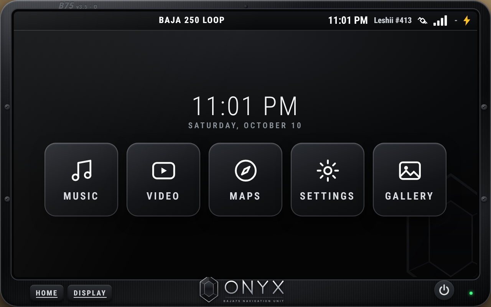
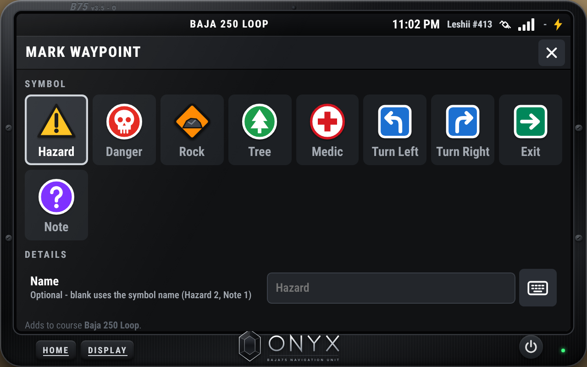
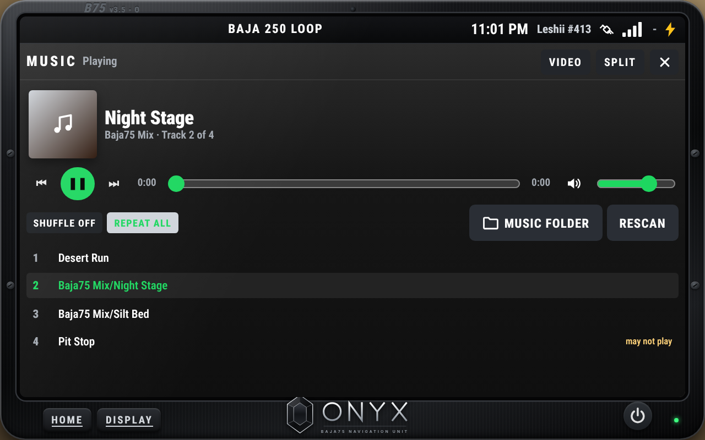
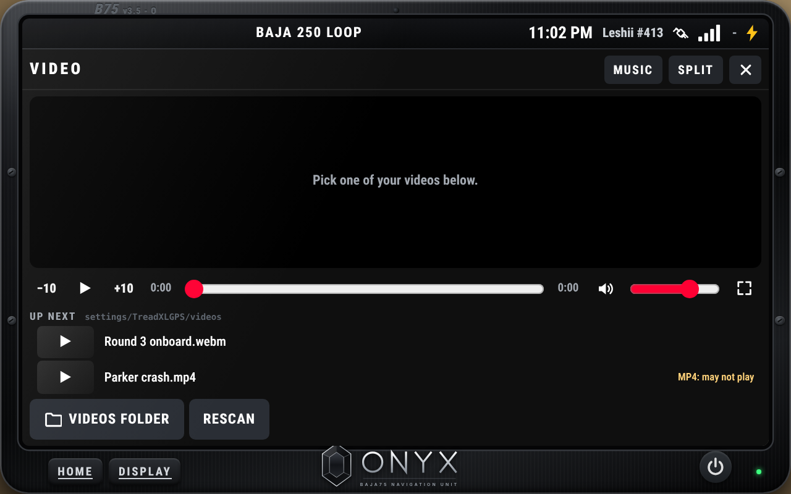
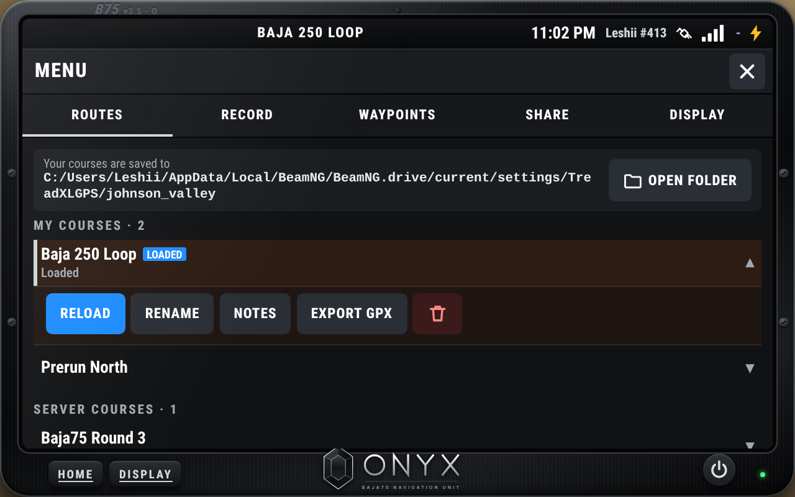
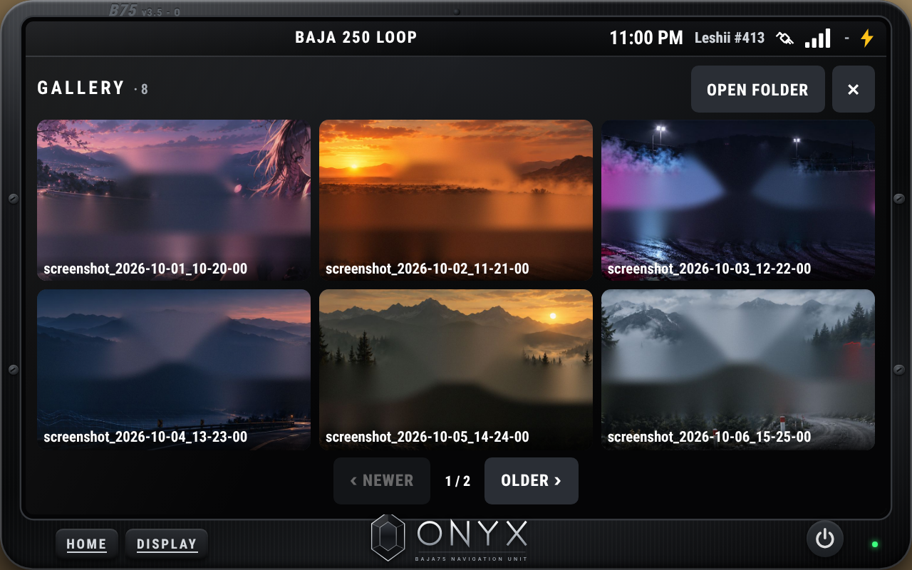

# Baja75 Navigation Unit

*Formerly "Baja75 Navigation Unit": from v3.1.1 it's the Baja75 Navigation Unit. Remove any older Baja75 Navigation Unit zip from your mods folder.*

**10" Off-Road Chase Navigator for BeamNG.drive / BeamMP - by Baja75**

As the Baja75 owner, I wanted a method for racers to complete a race on and offline. This is my first attempt at doing so.

A rugged 10″ off-road race navigator for BeamNG.drive and BeamMP, in the Baja75 Navigation Unit case: orange corner guards, the Baja75 logo on the bezel.

## Baja75 Navigation Unit - Onyx Edition

Road and overland exploration in metallic black.



| Mark hazards and turns | Music | Your own videos | Routes | Gallery |
|---|---|---|---|---|
|  |  |  |  |  |

## Eight editions

One code base, eight zips (`python3 dev/package.py` builds them). Install **one** of them: they replace each other.

| Zip | In the HUD app list | What it has |
|---|---|---|
| `Baja75-NavigationUnit-v….zip` | **Baja75 Navigation Unit** | All four modes: Chase, Adventure, Rally, Track. Made for the Baja75 BeamMP servers: see *Baja75 servers and the password* below |
| `Baja75-NavigationUnit-AdventureEdition-v….zip` | **Baja75 Navigation Unit - Adventure Edition** | The same unit as the one above (all four modes), under the Adventure Edition name |
| `Baja75-NavigationUnit-ChaseEdition-v….zip` | **Baja75 Navigation Unit - Chase Edition** | Chase mode only. Waypoints are **pits, start / finish, VCPs and speed zone start / end** only: no pacenotes, no direction calls or extras (shown or read out), no danger / hazard / rock / tree / note markers. A course made in the full GPS still loads: its other waypoints stay in the file, just not on this screen |
| `Baja75-NavigationUnit-RallyEdition-v….zip` | **Baja75 Navigation Unit - Rally Edition** | Rally mode only: full co-driver calls, rally pacenotes, the music bar |
| `Baja75-NavigationUnit-TrackEdition-v….zip` | **Baja75 Navigation Unit - Track Edition** | Track mode only: the gauge panel, telemetry fields, split screen and lap racing. Recording asks for the password or a license off the servers |
| `Baja75-NavigationUnit-FreeEdition-v….zip` | **Baja75 Navigation Unit - Free Edition** | Free: Adventure mode with the map, music, course import, racing, Times and 1 course of your own. Off the servers: no recording, video or waypoint list, and settings can be looked at but only the volume changed. MODE / DISPLAY say other features need the product key (Baja75 on Patreon). Everything opens on a Baja75 server or with a key |
| `Baja75-NavigationUnit-OnyxEdition-v….zip` | **Baja75 Navigation Unit - Onyx Edition** | Road and overland exploring, no racing, in a metallic black case. A home screen (Music, Video, Maps, Settings, Gallery: Gallery opens BeamNG's screenshots folder), Spotify-style music, a video player for your own videos (no YouTube or web), the map with other players' names, telemetry fields and the three toggleable screens. Records up to **3 routes** (small REC on the map), marks **hazards, danger, rocks, trees, medic, turn left / right, exits and notes** as map aids (no VCPs, speed zones, pits or timing). Nothing to unlock: it stays the Onyx Edition everywhere |
| `Baja75-NavigationUnit-CommonEdition-v….zip` | **Baja75 Navigation Unit - Common Edition** | The free one. All four modes with the map, music, **video** (big, map in the corner), Track gauges, pacenote calls and hazard alerts from the course, **course import** (GPX, server courses), **racing a course**, **Times** and the run log, **2 courses of your own**, and the Display settings. No MARK, waypoint or pacenote editing, Chase Map, GPX export or server pack off the servers. MENU's Share tab is **Import** |

In the Chase and Rally Editions button 1 shows the mode's name and doesn't switch, and the menus leave out what the edition doesn't have. MENU → Display → *About* says which edition is running.

### Baja75 servers and the password

**On a Baja75 server every edition has every feature** (all four modes, video, recording, MARK, Chase Map, pacenotes, sharing), from v3.1.1 (the Onyx Edition is the exception: it stays an exploring unit, and only its 3-route limit is lifted there). Off the servers each edition has its own limits, below; they switch the moment you join or leave.

On a Baja75 BeamMP server everything works. Anywhere else (single player, other servers) the map, MENU → Courses, MENU → Times and racing a course work, and:

- **Recording a course** asks for the **password** (v2.7.07; in the Chase and Rally Editions too).
- **Switching modes, the CHASE button, MARK, split screen**, the **Record / Waypoints / Display** tabs and the course buttons that write waypoints or share (*Auto pacenotes*, *Remove auto notes*, *Export GPX*, *Server pack*) ask for the **password** when you tap them. Ask Baja75 for it.
- The **Share** tab opens without it: **Import GPX** works anywhere. Sharing out (*Export GPX*, the *server pack* and its folder, the course map picture) shows a lock and asks for the password.
- The password unlocks them until the game closes; every game start is locked again. MENU → Display → *Password* → **LOCK** locks it sooner. Keys bound to these (Mark waypoint, Chase next, Start / stop recording, button 1) follow the same rules.

In the **Chase and Rally Editions** only recording is locked this way; everything else is open anywhere. The **Common Edition** has no password: off the Baja75 servers it keeps **2 courses of your own** in total (recorded, imported or copied, on any map; delete one to make room), and it records in single player only, never on another BeamMP server. For the server: put the full zip in both servers' `Resources/Client`. While you're on a BeamMP server, BeamMP turns off the mods in your own `mods` folder and runs the server's, and deletes the server's when you leave.

## What's on the screen

| Area | What it does |
|---|---|
| **Status bar** | Clock, the mode's name at the top center (*CHASE MODE*, *RALLY MODE*...) with the loaded course, chase target, REC light, GPS bars, and the map's air temperature right now as a number (°F / °C; `-` when the level has no temperature data) |
| **Up next (left)** | Rolling list of the next waypoints on the course with distance ahead, race mile and VCP status (cleared / missed), and the **drivers ahead of you on the course** (blue cards marked **ON ROUTE**, in order with the waypoints: gap, speed, race mile). Shows **No Waypoints Ahead** when there are none |
| **Data fields (top)** | Tap a field to change it: Speed, Race Mile, To Next, To Finish, To Next VCP, VCPs, Heading, Elevation, Trip, Max Speed, Off Course, To Race Veh, Race Veh Gap, Race Veh Speed, Time. Courses and free drive keep separate field sets |
| **Map** | The level's terrain image and road network (paved / dirt / trails), drawn by the GPS itself, plus the other vehicles around you (BeamMP players in cyan, AI in grey, with names). On top: the course line, with sharp turns highlighted yellow, orange or red; speed zones dashed white; VCP radius rings; waypoint symbols; your recorded track; the chase target. Drag to pan, mouse wheel to zoom, scale bar bottom-left. The center button under TRK UP brings the map back to your vehicle (it lights up blue while you're panned away). Levels without a map image show their terrain heightmap instead |
| **Map cards** | Above the speed: distance to the next VCP and to the next pit (each can be hidden), and the race clock with your last VCP split while racing |
| **Speed bubble** | Ground speed; a speed-limit sign appears inside a speed zone. The bubble turns red when you're over the limit |
| **Alerts** | Slow down, off course (from 15 m off the course line; 30 / 60 m in Display; in a timed run it also shows how long you've been off), wrong way, VCP ahead, VCP cleared / missed, speed zone ahead, finish |
| **START** | Left of REC whenever a course is loaded. On the starting line it starts the 10 second countdown straight away; anywhere else it puts the course in race mode and turns into **TO START** (tap twice to be moved onto the line), then **START RACE**. While racing it's **END RACE** (two taps) |
| **REC** | One tap starts recording a course (auto-named; rename it later). While recording it turns into **STOP** with the distance; tap to stop and save |
| **Pacenote bar** | When the loaded course has rally pacenotes: the next notes as BeamNG-style pacenote tiles (1-6 / HP / SQ / FL, caution, don't cut, crest, jump...) with the distance to each, bottom right of the map |
| **MARK** | Drop a waypoint (VCP, speed zone + limit, end zone, hazard, danger, rock, tree, pit, stop, medic, start/finish, turn left, turn right, exit, note) at your vehicle, or at the crosshair after panning |
| **CHASE / CO-PILOT MODE** | With a route loaded the button reads **CO-PILOT MODE**. **Chase Map**: pick a race vehicle to track (another BeamMP player, or any AI / spawned car offline). Shows distance, bearing, speed, race mile and gap along the course. Update interval can be **Live**, or 30 s / 1 / 2 / 4 min to mimic satellite team-tracking delays |
| **MENU** | **Courses** (load / race / rename / export GPX / server pack / delete, open folder) · **Times** (every timed run with its time, vehicle, warnings, resets, recoveries and off-course moments) · **Record** · **Waypoints** · **Share** (GPX import, server pack steps, course map picture background) · **Display** (units, track-up / north-up, auto zoom, terrain brightness, map data + reload, other vehicles + names, dark mode, map cards, clock source, sounds, alerts, damage log, course colour, sharp turns, bezel, map-only, trip reset, version) |
| **Start-up** | After joining a map: a power-on screen with a 15 second loading bar, the original start-up chime at the end of it (60 % volume; 30 / 60 / 100 % in Display), then 5 more seconds to read it (version, Leshii413 \| Baja75 Series, map). Opening the app on a map that's already loaded only shows it until the map is there. Put your own sound in `settings/TreadXLGPS/sounds/startup.ogg` (or `.wav` / `.mp3`) to replace it |

## Modes, the five buttons, split screen, video and music

Two buttons sit on the case, bottom-left (buttons 3–5 are kept for a later update and only bindable to keys) (hidden with *Device bezel* off). Each one can also be bound to a key, a wheel button or a controller button in Options → Controls (search "Baja75"):

| Button | What it does |
|---|---|
| **1 · MODE** | Switches the mode, in C-A-R-T order: **Chase**, **Adventure**, **Rally**, **Track** (was Tuner). The mode's name sits at the top center (*CHASE MODE*, then the loaded course); each mode has its own colour and keeps its own data fields |
| **2 · DISPLAY** | Switches the screen between the map, the **video** screen, the **music** player and, in Track, the **gauges**. With split screen on, it switches the right side |
| **3 · 4 · 5** | Kept for a later update (not on the case); they do nothing yet |

| Mode | What it has |
|---|---|
| **Chase** | The Baja chase navigator. Co-driver calls are directions only: **SHARP** (hairpins, square, 1, 2), plain (3, 4), **HALF** (5, 6) and **STRAIGHT** (flat) left / right, plus every caution and extra; never lengths, shapes or distances. The game's co-drivers recorded no "sharp", "half" or "straight", so the voice says the nearest words they did: *hard left*, *left*, *easy left*, *keep middle*. The pacenote bar shows the words. Music plays in the **music bar**; no split screen |
| **Adventure** | Everything, with split screen (map + video, music) |
| **Rally** | Full co-driver calls, race-mile fields, bigger pacenote tiles, and the **music bar**; no split screen |
| **Track** | The vehicle's own gauges as data fields, and a **gauge panel** (rev counter, gear, speed, throttle / brake / clutch, G-force, water and oil temperature, fuel, boost, battery) on the device's bezel finish, full screen or in split screen |

- **Split screen** (Adventure and Track; MENU → Display → *Modes & screens*, or SPLIT / FULL on the media screen): the map on the left, video, music or (Track) the gauges on the right.
- **Music bar** (Chase and Rally): a CarPlay-style player under the waypoint list (bottom-left of the map with *Map only*): cover, song, previous / play / next and a progress line. Tap it for the full player.
- **Music and the co-driver** (Chase and Rally): while the co-driver reads a course's pacenotes, music waits and plays again after. MENU → Display → *Rally pacenotes* → *Music with co-driver calls* → **PLAY ANYWAY** turns that off.
- **Album art**: the player shows a song's cover: a picture with the song's name next to it (`Song.jpg`), the picture inside the file (MP3, FLAC, OGG / Opus, M4A), or the folder's `cover.jpg` / `folder.jpg` / `front.jpg`. Pictures taken out of files are kept in `settings/TreadXLGPS/cache/art/`.
- **Video screen**: paste a YouTube link (PASTE reads your clipboard, or use the keyboard button to type it in a game window), then PLAY. Seek with the bar or ±10 s, mute and volume next to it, recent links below. YouTube's player refuses pages that don't say where they are (*Error 153*), and BeamNG's screens can't say it, so the GPS tries to play YouTube inside a small page that has a web address: **your own page** (MENU → Display → *Your own YouTube page*: the address of your copy of `yt.html`, never a YouTube link), **the web page** `https://leshii413.github.io/yt.html` (see `web/README.md`), the same page served by the game **on this computer** (`http://localhost:37575/yt.html`), and last YouTube's player directly. **BeamNG blocks this (seen in 0.39)**: the game's screen only opens YouTube's own pages in a frame (`beamng.log`: `OnBeforeNavigation DENIED` for github.io and localhost), and YouTube's own pages can't give the player a web address. A page that never opens is remembered and skipped next time (MENU → Display → *Blocked by BeamNG's screen* → **TRY AGAIN** tests them again). MENU → Display → **Check sites** tries about 40 sites and lists which ones the screen opens (also written to `beamng.log`); if one that can host a page opens, `yt.html` can go there. Until then: **WEB** opens the link in your browser / the Steam overlay, and your own **WebM** files (VP8 / VP9) in `settings/TreadXLGPS/videos/` always play on the screen (MP4 / H.264 can't play in the game's UI browser, convert it to WebM first).
- **Full screen video** (the corner-arrows button at the end of the video controls, or the *Full screen video* key): the video fills the **whole GPS screen**, or, with split screen on, the **whole split side** (the map stays on the left). The controls float over the video and hide after 3 s; move the mouse or tap near the bottom to bring them back. In full screen, **SPLIT** (Adventure and Track) switches between the two. The arrows button again leaves full screen.
- **Music player**: drop music in `settings/TreadXLGPS/music/` (made when the GPS starts; sub-folders are fine): MP3, OGG, Opus, FLAC or WAV (M4A / AAC may not play). Play / pause, previous / next, seek, shuffle, repeat all / one / off, volume. Music keeps playing while you look at the map.
- **Track gauges** come from the game's electrics stream, or straight from your vehicle 4 times a second when the stream doesn't reach the GPS. **BATTERY** shows the charge left on electric and hybrid vehicles; BeamNG doesn't simulate a 12 V battery on fuel vehicles, so there it reads **CHG** while the engine runs (charging) and **OFF** when it's off.
- **Media keys** (Options → Controls, search "Baja75"): volume up / down, mute, play / pause, next (next song, or +10 s on a video), previous (previous song, or −10 s), split screen, full screen video.
- **TikTok and Instagram** can't play inside the GPS: both refuse to be shown inside other pages, their feeds need you logged in, and BeamNG's UI only allows connections to your own computer. Paste a TikTok or Instagram link and press **WEB** to open it in your browser / the Steam overlay.

## Courses and files

Everything lives in your BeamNG user folder (`%LOCALAPPDATA%\BeamNG\BeamNG.drive\current\`) under **`settings\TreadXLGPS\`**. Use MENU → Courses → **Open folder** to jump there; the screen also shows the path.

| Folder | What's in it |
|---|---|
| `settings/TreadXLGPS/<map>/` | Your courses: `<name>.json` (track) and `<name>.wpt.json` (waypoints, editable by hand). v2.0 saves are already here |
| `settings/TreadXLGPS/gpx/<map>/` | GPX exports. To import, drop `.gpx` files here (or in `settings/TreadXLGPS/gpx/`) → MENU → Share → Import |
| `settings/TreadXLGPS/serverpack/` | Courses you added with **Server pack**, laid out ready to zip |
| `settings/TreadXLGPS/server/<map>/` | Courses that come from a server's client mod. They show under **Server courses**, read-only; use *Save a copy* to edit one |
| `settings/TreadXLGPS/times/<map>/` | Your race times per route (best time + the last 20 runs) |
| `settings/TreadXLGPS/race_log.txt` | The run log: one line per timed run, plus a line per off-course moment and damage hit, all maps (see below) |
| `settings/TreadXLGPS/sounds/` | Optional: your own `startup.ogg` / `.wav` / `.mp3` |
| `settings/TreadXLGPS/music/` | Your music for the music player (made when the GPS starts) |
| `settings/TreadXLGPS/videos/` | Your WebM videos for the video screen (made when the GPS starts) |

Every course can also have **notes** (`<name>.notes.txt`, lines starting with `#` stay hidden) and a **picture** (`<name>.png` or `.jpg`) next to its files. Racers see them in MENU → Courses when they pick the course. *Notes* in the course's buttons starts the notes file for you and opens the folder. The Share tab shows each folder as it really is on your disk (whatever drive or user name you have), with an *Open* button.

- **Record**: tap **REC** (or use the keybinding), drive, MARK your VCPs, speed zones, pits and hazards, then tap **STOP**. The course saves and loads straight away, and a message shows the file it wrote (or says it couldn't write it). Pick a name first under MENU → Record if you like, or rename it later.
- **Race mile** is the distance along the course line. A VCP counts as **cleared** inside its radius (37 m / 120 ft by default). It counts as **missed** if you pass it on course without getting that close. VCPs behind the point where you joined the course are ignored. *Reset run* clears them.
- **Speed zones** run from a *Speed Zone* symbol (with its limit) to the next *End Zone* symbol (or the finish).
- Older saves show up under **Older saves**: v1 files in `settings/TreadXLGPS/` itself and v2.1 files in `TreadXLGPS/courses/<map>/`. Renaming one moves it into your folder.

### Race This Route

Any course with a course line can be raced: press **START** on the main screen with the course loaded, or **Race this route** in MENU → Courses.

1. On the starting line (within 10 m of the start of the course line), START goes straight into the countdown. Anywhere else the map says **TRAVEL TO STARTING LINE**, with a green guide line to the start, and the button shows **TO START** with the distance: drive there, or tap it twice to be moved onto the line facing down the course.
2. On the line the map says **AT THE STARTING LINE** and the button says **START RACE**.
3. Press it: a 10 second countdown (white on a black box) with beeps from 5. Rolling more than 15 m before GO is a **jump start** and sends you back to the line.
4. The race clock runs on the map with your VCP splits. Crossing the finish (15 m before the end of the course line) stops it: the result shows your time, your best, the VCPs you cleared and the run's warnings, resets and recoveries. It stays up for 90 seconds with a *Clears in N s* countdown; **CLOSE** takes it away sooner. Times are kept in `settings/TreadXLGPS/times/<map>/`.

Drive back to the start (or TO START) to race it again. A plain *Load* or *Unload* leaves race mode. The clock runs on game time, so pausing the game pauses it.

**Run log.** Every timed run is added to `settings/TreadXLGPS/race_log.txt` (finished runs, and ended ones as DNF) and listed in MENU → **Times**, newest first (tap *off-course moments* under a run to open them). One line per run, then one indented line per off-course moment and per damage hit:

```
2026-10-07 00:26:46 UTC+08:00 (Singapore Standard Time) | Map: johnson_valley | Course: Baja75 Race Round 1 | Time: 1:52.1 | Vehicle: Gavril D-Series D15 4WD (pickup) | Off course: 1 | Wrong way: 0 | Speeding: 1 | Missed VCPs: 0 | Jump starts: 0 | Resets: 1 | Recoveries: 1 | Time off course: 0:07.9 | Damage: 1 | Driver: Leshii413 | Number: 413 | Time ms: 112183 | VCPs: 4/4 | Session: Baja75 server | Unit: v3.1.5 | Run ID: 6a1f3c2b9e04d1
  Off course 1 | At: 0:20.9 | RM: 0.32 mi | Off for: 0:07.9 | Resets: 1 | Recoveries: 1
  Damage 1 | At: 0:42.2 | RM: 0.56 mi | Parts: Flat tire RR, TT6 Front Bumper 35%
```

- Date, time and time zone come from your computer. Each warning is counted once every time it comes on during the run.
- **Off-course moments**: every time OFF COURSE comes on (15 m from the course line by default) a timing node is taken: the race clock (*At*) and race mile (*RM*) where it started, how long you stayed off (*Off for*, until you're back within 12 m, or the end of the run), and the resets and recoveries you used inside it. *Time off course* is the total.
- **Resets** are the game's vehicle reset (e.g. R, or Home to your saved spot); **Recoveries** are the game's recover / rewind (Insert, tapped or held). The GPS hears a recovery from your vehicle itself and from the game's hook where the game version sends one, and counts it once; the vehicle being put back at the end of it is not a reset. Moving to the start with TO START isn't counted. Each counted reset and recovery is also written to `beamng.log` (`TreadXLGPS`), handy if a count looks wrong.
- **Damage** (Display → *Damage log*, on by default; turn it off and the Damage parts disappear from the log): when the car takes a hit during a run, the parts that got at least 5 % worse are listed with their damage, worst first, plus flat tyres and engine faults (radiator leak, oil pan leak, engine disabled...).
- The file keeps the last 500 runs.
- **For race scoring** (from v3.1.5): *Driver* (MENU → Times → *Driver name*, or your BeamMP name when that's blank) and *Number* (*Race number*), *Time ms* (the exact time in milliseconds; the shown time is cut to tenths), *VCPs* (cleared / total), *Session* (Single player, BeamMP or Baja75 server), *Unit* (the version) and a *Run ID* for that run. Older lines without them still read fine.
- **Export for scoring** (MENU → Times): saves a copy of the run log as `settings/TreadXLGPS/exports/Baja75_results_<driver>_<number>_<date>.txt` and opens the folder. Send that file to the race organizer: the **Baja75 Scoring Management System** reads it.
- **Server results** (Adventure, Rally, Track and Chase Editions, v3.1.6): on a BeamMP server that runs the Baja75 results collector, every timed run on one of the server's courses (same map, name and route length) is also sent to the server when it ends, finished or DNF. The unit says *Result sent to the server*. Your own run log is kept as before. Server owners: see `Baja75-NavigationUnit-ServerResults` (a separate zip for `Resources/Server`).
- **Sign in** (Adventure, Chase, Rally and Track Editions, v3.1.7): the unit puts a username on every course you record and every timed run. It is only a name, with no password. The first start asks for it (*First time set up*), with your race number. On a BeamMP server you are signed in with your BeamMP name (not as a Guest). Offline, as a Guest, or after you leave or lose the server, recording and racing ask you to sign in first; the screen remembers your username, so it is one tap. MENU → Times shows who is signed in. Course info shows who recorded a course.

### Rally pacenotes

Rally pacenotes are a second kind of marker, built on **BeamNG's own rally pacenote system** (BeamNG.drive 0.39+). The mod ships none of the game's files: the words, 1-6 corner numbering, colours and icon names are read live from the game's rally pacenote style, and the voice is one of the game's own co-driver voicepacks (Dirtwheel, AK, RH), played through the game's co-driver intercom.

- **MARK → Rally pacenote**: pick LEFT / RIGHT (or NO CORNER), the corner (1-6, HP hairpin, SQ square, FL flat), length (short, half long, long, extra long), shape (opens, tightens, over crest...), caution (care, caution, double caution) and up to 3 extras (don't cut, cut, keep in, crest, jump, bump, dip, watersplash, bridge, narrows, junction, brake, onto gravel...). The preview shows the tiles and the call; **Listen** plays it in the co-driver's voice. Mark it where the corner starts. The *Mark waypoint* key drops the last pacenote you built.
- **Auto pacenotes** (MENU → Courses → pick a course): reads the corners (and crests) from the course line using BeamNG's own corner-size ranges and length buckets, and writes them as pacenotes. Running it again replaces the auto notes and keeps the ones you marked yourself; *Remove auto notes* takes them out. Edit or delete single notes in MENU → Waypoints.
- **Driving a saved route**: the co-driver reads each pacenote ahead of the corner, timed to your speed (Display → *Call timing*: early / normal / late). Notes close together are read as one call with "into" / "and"; otherwise the distance to the next note is called ("three right long, tightens, 150"). In **Race This Route** the co-driver also counts down 5-4-3-2-1-GO and calls false starts.
- The tiles are also sent to **BeamNG's own rally pacenote display** (the same event its rally stages use), so the game's display shows them too when it's on screen.
- Pacenotes are saved with the course (`<name>.wpt.json`, field `pn`), go into the server pack, and travel in GPX files (`<txl:pn>R3 len:long sh:tightens</txl:pn>`).

### Sharing courses

- **Course map picture**: every Server pack and Export GPX also saves `<name>.map.jpg` (1920 × 1080 JPEG: the course line with direction arrows, start / finish, VCPs, pits, speed zones and hazards with their names, the pacenotes as BeamNG-style tiles, a north arrow and scale bar, and a title band) and `<name>.info.txt` (course name, map, distance in miles and kilometres, elevation change) next to the course. MENU → Share → *Course map picture* picks the background: **MAP** (the game's own map image of the level) or **SATELLITE** (the level's terrain heightmap, e.g. `theTerrain_smoothed_heightmap.png`, shaded as relief). If the level has only one of them, that one is used. The GPS app has to be on screen while you export (it draws the picture); without it you get the info text and a message. With no picture of your own (`<name>.png` / `.jpg`), the map picture is the one shown in MENU → Courses.
- **GPX**: Courses → pick a course → **Export GPX**. The file keeps the track and every waypoint, including speed limits and VCP radii. Send it to another racer; they drop it in their `settings/TreadXLGPS/gpx/<map>/` and import it. Game positions are converted to latitude/longitude around a fixed point for each map, so a round trip loses less than 5 cm.
- **Server pack (BeamMP, or quick share)**: for anyone playing with friends on a server who wants a race route without all the extra perks and HUD. Run a race or course just by map guidance and markers: save it as a map file for your own self-hosted BeamMP server, or quick-share the files with others.
  1. Courses → pick a course → **Server pack**. Repeat for each course. Its notes and picture go with it, a notes file is started for you, and the course map picture + info text are added.
  2. Open the server pack folder (MENU → Share) and add your install notes and pictures next to each course (`<name>.notes.txt`, `<name>.png` / `.jpg`). The README in there explains everything.
  3. Zip the `settings` folder in there (the zip's root must hold `settings`), for example `baja75_courses.zip`, and put it in the server's `Resources/Client` with the Baja75 Navigation Unit zip. Every racer then sees those courses under **Server courses**. Or send the zip to friends.

## Alerts app

A second HUD app, **Baja75 Navigation Unit - Alerts**, shows the GPS warnings big and anywhere you like on the screen: a flashing red **WRONG WAY**, a flashing amber **OFF COURSE**, **SLOW DOWN** in speed zones, **MISSED VCP** and **JUMP START**. **Danger** (red) and **hazard** (amber: rock, tree, warning) markers on the course show from 400 m ahead until you pass them, and flash 3 times when each one comes up (on the GPS screen too). Add it from the HUD app list (Gameplay) next to the GPS and place it where you'll see it.

Its options are in the GPS: MENU → Display → *Alerts*: faults only or all alerts (VCP ahead, speed zone ahead, cleared, race notices), flashing on/off, and whether the GPS screen shows its own alerts too.

## Pacenotes app

A third HUD app, **Baja75 Navigation Unit - Pacenotes**, pops up the rally pacenote tiles (the same icons as the GPS's pacenote bar, in BeamNG's rally colours) as each note comes up and takes them away once you've passed it. Add it from the HUD app list (Gameplay) and place it where you look while driving; it shrinks to fit any size you give it.

- **When it pops up** (GPS: MENU → Display → *Rally pacenotes* → *Pacenotes app*): **WHEN CALLED** (the notes the co-driver has read out, until you pass them; with the co-driver off, the notes about 5 seconds ahead), **NEXT NOTES** (the next notes all the time) or **OFF**.
- Up to 3 notes; the next one is full size with its distance in orange. In **Chase mode** it shows the direction icon with the co-driver's words (*SHARP LEFT*, cautions and extras under them) and no corner numbers, shapes or distance calls.
- In the full GPS, the Rally Edition and the Common Edition. The Chase Edition has no pacenotes, so its zip leaves this app out.

## Video, music and picture-in-picture

- **Video** plays big, with the map small in a corner while a video is on (tap the little map for the full map). The **full screen** button makes the video fill the whole unit, map still in its corner.
- **Music** can be a small **card** over the map, or the full / split **screen**.
- MENU → Display → *Modes & screens*: **Map over the video** (top left / right, bottom left / right), **Music player** (card or screen) and the card's corner. These choices are open on a Baja75 server or with the unit unlocked; otherwise the map and the music card sit bottom right.
- The **Common Edition** now plays video too (video big, map bottom right; music as a card bottom right).

## Unlocking and licenses

On a Baja75 or Leshii413 server every edition has every feature. Off the servers, enter a **password or license key** in MENU → Display → *License* (or when a locked part asks). A personal-use unlocking license for your own BeamNG can be bought from **Baja75 on Patreon**. If your license has a time limit, a countdown by the clock and MENU → Display → *License* show what's left. When your key runs out, contact **Baja75 on Patreon** for another key, with your proof of purchase, your trial access, or where you found the mod. If the unit ever shows *This unit is disabled*, take a screenshot and send it to Baja75 Support.

The version and package letter sit next to **B75** on the case: **C** Chase, **R** Rally, **T** Track, **P** Public (Common), **F** Free; the full unit shows the version only.

## Recording view

While you record, the buttons are **STOP** (red, with the distance so far), **MARK**, **UNDO** (takes back the last waypoint you marked on this recording) and **MENU**.

## Power button

The round button at the far right of the bezel, next to the green light (hover: *Restart System*), restarts the GPS screen. The unit fades to black for a moment (a theme you picked goes on then), shows a short start-up screen, and loads the map, courses and media again. A timed run keeps running in the game meanwhile; video and music stop.

## Home screen and themes (v3.1.9)

**HOME** (the first button under the screen, bindable as *Button 3 (Home)*) opens the home screen: the clock and big tiles for **Music**, **Video**, **Maps** (back to the map), **Settings** and **Gallery** (your BeamNG screenshots folder). MODE or DISPLAY take you straight back.

**Themes** change the case, the colours and the home screen. Pick one in MENU → Display → *Screen* → *Theme*, then press the **power button**: the whole unit fades to black and comes back in the new theme.

| Edition | Themes |
|---|---|
| Full unit | all: Desert Racing, Rock Crawling, Rally, JDM, Drift, Overland, Anime |
| Adventure Edition | Overland, Anime |
| Chase Edition | Desert Racing, Rock Crawling, Anime |
| Rally Edition | Rally, Anime |
| Track Edition | JDM, Drift, Anime |
| Common and Free Editions | Anime |

Every edition also keeps the standard **Baja75** look. The Onyx Edition has its own metallic black design.

## Smoother (v3.5)

- Lighter on the game: route detection on long courses and full servers, no map drawing while the map isn't on screen, live engine data only in Track mode.
- MENU → Display → *Map frame rate*: SMOOTH or 30 FPS (slower computers). The line under it shows how fast the unit runs; send it with any report of a slow or late map.

## Map, music and gallery extras (v3.4)

Every edition but Free and Common (on a Baja75 server those get them too):

- **Clean map**: MENU → Display → On the map → *Clean map* shows only the route and your speed. Or hide parts one by one: *Map buttons* (zoom, compass, center), *Bottom buttons*, *Data boxes*, *Speed box*, *Scale bar*. With buttons hidden, tap the map to see them for a few seconds (HOME → Settings always opens the menu).
- **Move the map in video mode**: drag the small map in the video's corner to look around; tap it for the full map; the round button puts it back on your car.
- **Music bar**: the music player can be a bar over the map, like a phone's maps app with music playing (MENU → Display → *Music player* BAR), along the **bottom** or the **top** of the map or down its **left** or **right** side. Tap it for the full player.
- **Music in split screen in every mode**: Chase and Rally too (Split screen ON, then DISPLAY to the music player).
- **Gallery**: HOME → Gallery shows your BeamNG screenshots, 6 to a page, newest first; tap one to see it over the whole screen (‹ › for the next ones). OPEN FOLDER opens the folder.

## Pass requests during a race (v3.3)

Every edition that can race a course (all but Onyx) has **PASS** next to END RACE while a race is running, and a key for it (Options → Controls → *Baja75 Navigation Unit: Request a pass*).

- **PASS** asks every other driver within **100 m** of your vehicle (3D distance, in any direction) to let you by. Their unit shows **PASS REQUEST - <your name> is requesting a pass**, with **OK TO PASS** and **Dismiss**, on whatever screen it's on (map, home, music, video, menus). With only the **Alerts app** on screen, the request shows there instead.
- You hear back: *Pass request sent to 2 drivers*, *Seen by ...*, *... OK TO PASS*, or *No other drivers within 100 m*. One request every 5 seconds; each one lasts 8 seconds.
- Don't want the button? MENU → Display → Alerts → *PASS button* HIDE; the key still works.
- **OK TO PASS** has its own key (*Baja75 Navigation Unit: OK to pass*, the newest request). It only answers; it never moves either car. Dismiss just closes the card.
- **On a BeamMP server**, the server picks who gets it: install the **Server Race Alerts** zip (`Resources/Server/Baja75RaceAlerts`, see its README). Race control starts and ends the race there (`b75race start` / `end` in the console or `/b75race` in chat); requests only work while it runs. On a server without it, PASS says pass requests are off.
- **Single player**: the same 100 m rule over the cars around you. AI cars don't have screens and don't yield on their own; scenario scripts get `onBaja75PassRequest` / `onBaja75PassAcknowledged` and can ask you to let an AI car by with `TreadXLGPS.passRequestFrom(vehicleId, name, number)`.

## On the vehicle's own screen (v3.2)

Turn on MENU → Display → *Screen* → **On the vehicle's screen** and the unit moves onto the car's own navigation screen (the stock cars that have one, such as the ETK, Bolide or Vivace dash screens). The HUD app hides itself while it's there; a car without a navigation screen keeps the unit in the HUD and tells you so once.

- **Click the dash screen** (in a close-up / cockpit view) or press **Pop up** (Options → Controls → *Baja75 Navigation Unit: Pop up*, no default key) to open the full unit big in the middle of the view, for marking, menus and settings.
- **BACK TO DASH ✕** (or the key again) puts it back on the screen.
- The unit's other keys keep working while it's on the dash. Turning the setting off gives the car its own screen back.

## Display options worth knowing

- **Dark mode**: OFF / ON / AUTO (night map colours from 7 PM to 6:30 AM).
- **Clock**: COMPUTER time or IN-GAME time of day (status bar and the Time field).
- **Map cards**: distance to the next VCP and to the next pit. They're also data fields (*To Next VCP*, *To Pit*, *Race Time*).
- **Sounds**: start-up chime and race countdown on or off; start-up chime volume 30 / 60 / 100 %.
- **Rally pacenotes**: co-driver calls on / races only / off, call timing, co-driver voice, pacenote bar, the Pacenotes app, BeamNG pacenote display.
- **Off-course warning**: 15, 30 or 60 m (49 / 98 / 197 ft) from the course line; 15 m by default.
- **Damage log**: on / off (the parts damaged in each crash during a timed run, in the run log).

## Controls (Options → Controls, search "Baja75")

`Baja75 Navigation Unit: Start / stop recording` · `Mark waypoint` (uses the last symbol picked on the MARK screen) · `Chase next vehicle` · `Zoom in` · `Zoom out` · `Track up / North up`. No keys are bound by default, so nothing clashes with your setup.

## Install

Use a release zip, or build them: `python3 dev/package.py [out folder]` writes the full, Chase Edition, Rally Edition and Common Edition zips (the zip root holds `lua/`, `scripts/`, `ui/`, `mod_info.json`). Then:

- **Single-player**: drop the zip into `%LOCALAPPDATA%\BeamNG\BeamNG.drive\current\mods\`.
- **BeamMP server**: drop the zip into `Resources/Client/` so players download it. No server plugin is needed, because other players' cars exist on each client.
- **Keep only one Baja75 Navigation Unit zip** in `mods` (delete older versions). Two versions fight over the same files; the GPS shows a red banner when it detects that.

In game, add **Baja75 Navigation Unit** (or your edition: **Baja75 Navigation Unit - Chase Edition** / **Rally Edition** / **Common Edition**) from the HUD app list (Gameplay). It keeps a 16:10 shape; resize it freely.

## First in-game check

1. No red banner on the GPS. If there is one, it says what's wrong: the game script isn't running (console `~`, look for red `TreadXLGPS` lines) or two versions are installed. MENU → Display → *Map data* shows the map name.
2. The GPS powers on: 15 s of loading, the chime, 5 s to read the screen, then the level's terrain and roads. MENU → Display → *Map data* says how many roads it found. If it says *Waiting*, press *Reload map*.
3. Click a name box and type: BeamNG gives the keyboard to the box while it has the caret, and back to driving when you close the sheet (✕) or press Esc. If your game version doesn't, press the **keyboard button** next to the box: a small game window opens, type there and press Enter.
4. Record a short loop: the message after STOP names the file it saved.
5. Reload after edits: **F5** for UI files, **Ctrl+L** for Lua.

## Development

```
dev/lua_tests/test_treadxlgps.lua   297 checks of the Lua logic with stubbed game APIs (race timing, run log, resets,
                                    recoveries, damage log, pacenote calls, course map picture, video page server,
                                    telemetry, album art, drivers ahead on the route, Chase Edition, Baja75 server
                                    check and password, Common Edition)
dev/lua_tests/test_pacenotes.lua    pacenote engine against the REAL game rally files (GAME_LUA=<folder holding lua/>):
                                    native style, every builder phrase has audio in each voice, intercom playback
dev/preview/gen_events.lua          runs the real Lua through scripted drives -> UI event streams (road graph,
                                    terrain tiles, other vehicles, typing window, Race This Route)
dev/sounds/make_startup.py          synthesises the start-up chime (original, no samples)
dev/preview/make_terrain.py         fake level terrain image for the previews
dev/preview/make_heightmap.py       fake 16-bit terrain heightmap (the SATELLITE course map picture)
dev/preview/run_preview.py          renders the real app.js (and the Alerts and Pacenotes apps) in headless Chromium; checks JS
                                    errors, the base map, course/map alignment (px) and what each screen must show
dev/preview/click_test.py           clicks through the UI (incl. typing) and compiles every Lua command it sends
dev/preview/video_e2e.py            YouTube Error 153 fix end to end: the real Lua page server (needs LuaSocket),
                                    the GPS opened from file:// (sends no web address, like the game), a fake YouTube
                                    that answers 153 without a Referer; checks Referer, relay both ways, fall-backs,
                                    pages the screen never opens (remembered, also after a reload), YouTube links
                                    refused as a page address, Check sites
dev/preview/video_server_run.lua    runs just the page server for video_e2e.py
dev/make_web_page.py                writes web/yt.html (the YouTube page for a website) from the Lua page; --check
web/                                yt.html + how to put it on GitHub Pages
dev/package.py                      builds the four zips (full, Chase, Rally and Common Editions) from the tracked files
dev/lock_digest.py                  digests for a new password / Baja75 server-name words (the mod keeps only digests)
dev/sync_pn_tiles.py                copies the pacenote tile code (GPS app.js / app.css, between markers) into the
                                    Tread XL Pacenotes app; --check
```

```
luajit dev/lua_tests/test_treadxlgps.lua
python3 dev/preview/make_terrain.py
python3 dev/preview/make_heightmap.py
luajit dev/preview/gen_events.lua dev/preview/out
python3 dev/preview/run_preview.py
python3 dev/preview/click_test.py luajit
python3 dev/preview/video_e2e.py luajit    # LUA_PATH / LUA_CPATH must find LuaSocket
python3 dev/make_web_page.py --check
python3 dev/sync_pn_tiles.py --check
python3 dev/package.py dist
GAME_LUA=/path/to/BeamNG.drive luajit dev/lua_tests/test_pacenotes.lua   # with the game's rally files and voices
```

How the map works: when a level is loaded (and again whenever the game rebuilds its road graph), the Lua extension reads the AI road graph (`map.getMap()`, the same network BeamNG's own navigation map uses, minus roads hidden from navigation) and the level's terrain image (`info.json` → `minimap`, or the TerrainBlock), and sends them to the UI once as compact arrays. `app.js` draws them itself (`WorldView`): the terrain image and roads go into one SVG in world coordinates, together with the course, track and VCP rings, and a single CSS transform per frame puts it under your vehicle. Other vehicles come with the 10 Hz HUD update (players and AI within 3 km, no props). **Drivers ahead** (`FIELD` in the Lua, 5 times a second): every other vehicle that is a real vehicle (not a prop, and not the walking unicycle, so nobody on foot), on the course line (inside the off-course distance, a little more to stay on) and ahead of you along it; up to 6, nearest first. Off the course, on foot or behind you: nothing is sent for them. In BeamMP only other players count; offline, AI too.

Course map picture: `Snap.make` (Lua) writes `<name>.info.txt` and sends the course to the app (`TreadXLGPS.snapshot`: line, waypoints with pacenote tiles, the level's map tiles and its `*heightmap*.png` placed over the TerrainBlock). `app.js` draws it on a 1920 × 1080 canvas (the heightmap is blurred, lit from the north-west and tinted for SATELLITE) and sends `canvas.toDataURL('image/jpeg')` back in 60 kB base64 pieces (`TreadXLGPS.snapChunk`). Lua decodes them (the game's `mime.unb64`, or plain Lua) and writes the JPEG in binary. Resets come from the `onVehicleResetted` hook (player vehicle only); recoveries from `RunLog.VLUA` (put in the player's vehicle while a race is set up: it wraps `recovery.startRecovering` / `stopRecovering` and calls `TreadXLGPS.vehRecovery(id, "start"|"stop")`) and from `onStartRecovering` / `onStopRecovering` when the game sends them, de-duplicated by `RunLog.recoverStart`; damage hits from the jump in `map.objects[id].damage`, after which the vehicle reports `beamstate.getPartDamageData()` plus flat tyres and engine faults from `damageTracker`.

Typing: BeamNG 0.39 hands the keyboard to a focused text box by itself (the old `setCEFFocus` call is a no-op there), so the app never intercepts keys. The keyboard button calls `TreadXLGPS.promptText`, which draws a small ImGui text window and sends the text back as `TreadXLGPS.text`.

Fonts: Roboto Condensed (SIL Open Font License, `ui/modules/apps/Baja75-GPS/fonts/OFL-RobotoCondensed.txt`), subset to Latin.
